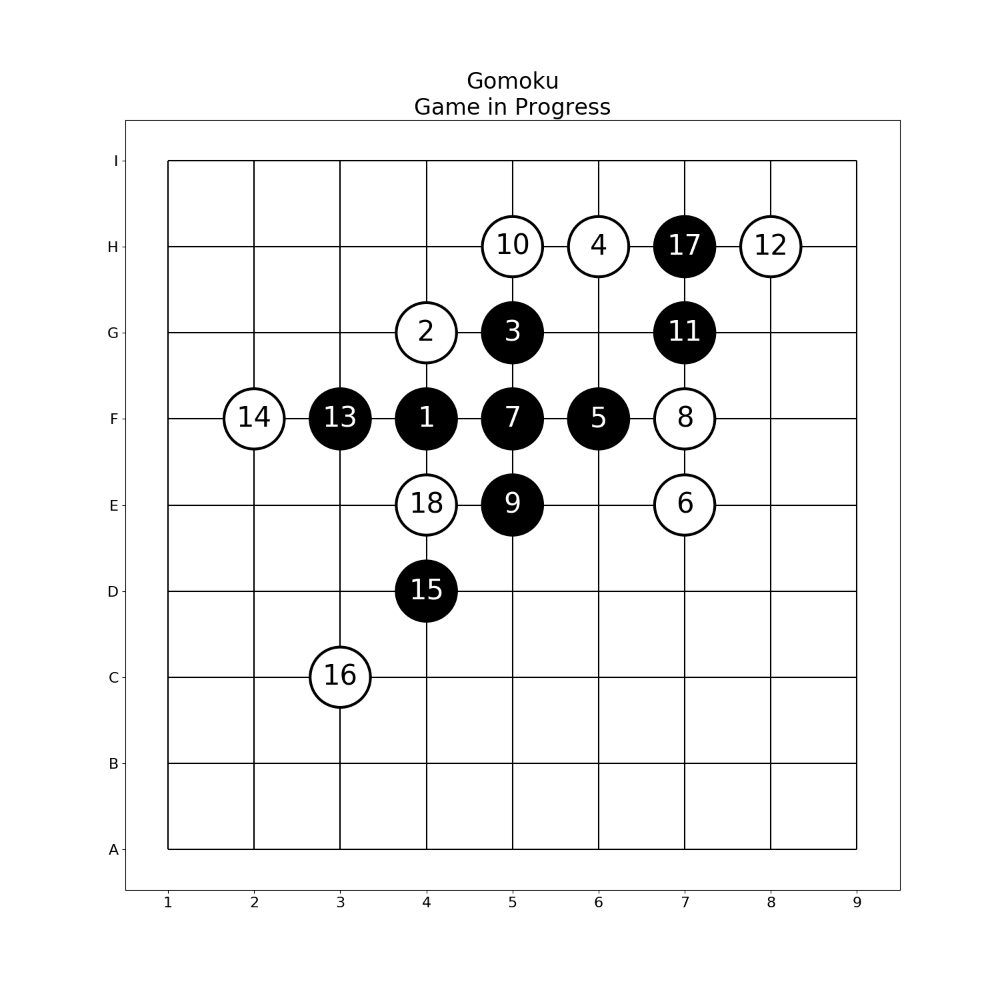
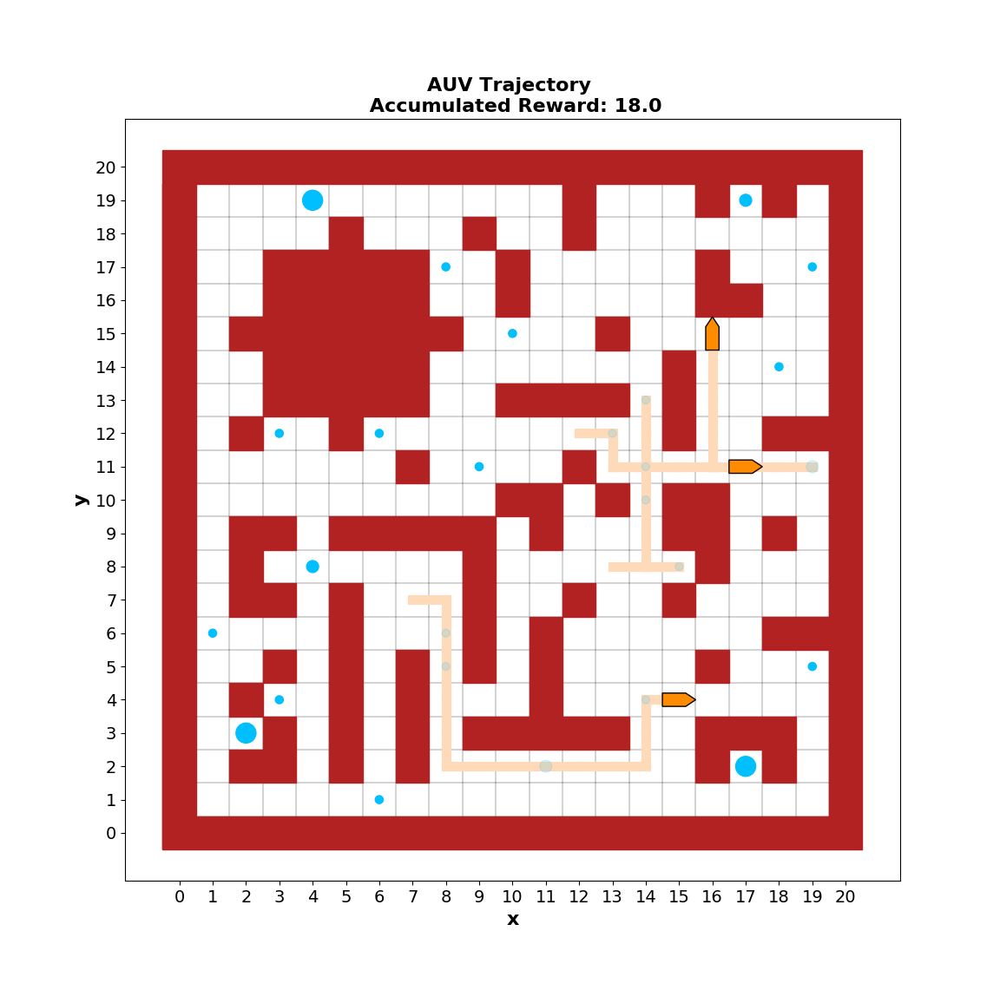

# MCTS for Collaboration
Advanced lecture of MIT 16.412 - Cognitive Robotics - in Spring 2019

## Prerequisites
* Python 3.5 or higher version
* Jupyter
* nbgrader

## Structure
### Lecture Slides
The lecture slides will introduce the MCTS algorithm's motivation, background,
core modules and extensions that can be made for multi-agent collaboration.

### MCTS Core Algorithm
The MCTS algorithm includes two files under the `src` folder - `state.py` and 
`mcts.py`.

To use our algorithm, create a `MonteCarloSearchTree` object and give it 
a `State` object, which should be specialized for the problem being dealt with,
as initial state. How to build such a `State` class will be in
[Part 2 of the pset](#pset-part-2).

The MCTS algorithm will use the default policies for select, expand, simulation
and backpropagate, but one can build their own policies and pass them to the
`MonteCarloSearchTree` constructor.

To search for actions based on the current root, which represents the current 
state, call the `search_for_actions` method. After an action is taken, one can
call the `update_root` method to switch the root to a newer state.

### Examples
We provide two examples, namely [`Gomoku`](https://en.wikipedia.org/wiki/Gomoku)
and `Maze`. They are used in the pset for illustration purpose and you can find
more detailed explanation of the rules in the
[Problem Set](#problem-set) Section.

One can know how to build a `State` class
in order to use our MCTS code from `gomoku.py` and `maze.py`.

### Problem Set
The pset is at `pset/pset_mcts_collaboration.ipynb`.

#### Pset Part 1
In the first part of the pset, we provide our modularized MCTS algorithm, and
one needs to implement `select`, `expand`, `simulate` and `backpropagate`
functions in their default way, that is to say, UCB needs to be used as tree 
policy and random rollout is used in simulation. Our MCTS code is highly
modularized and you can change these functions in the future to extend your
MCTS code, like incorporating a neural network to guide rollout.

The first part uses `Gomuku` as an example. A Gomoku game has two sides - black
and white, and the black side moves first. Whichever side first has 5 pieces
in a line, either vertical, horizontal or diagonal, wins. This is like an
enlarged version of tic-tac-toe. Under this rule, the black side can always 
win, given the optimal strategy adopted, so a professional-level Gomoku game
has more rules to ensure fairness, however, for the pset, you do not need
to consider them.

You will be given a Gomuku game that has been played for a while, as below.

The black side has already taken great advantage, and you are building an AI
to help turn advantage into victory. A possible way for the black to win is
shown below, but it is neither unique nor optimal.

#### Pset Part 2
In the second part of the pset, one learns how to create a `State` class in
order to use the MCTS code we provide. In general, one needs to implement 4
core properties and methods, namely `reward`, `is_terminal`, `possible_actions`
and `execute_action`, and probably some auxiliary functions, to be passed into
the MCTS algorithm. The required properties and methods can be found in 
`src/state.py`, and we recommend inheriting the `AbstractState` class when 
building your `State` class.

The second part uses `Maze`  as an example. We provide the some example
environment. Red tiles are obstacles and blue circles are rewards, and the 
agents' task is to collect as much reward as possible within given time.

If your implementation of the required properties and methods is correct, you
should be able to call the simulation function we have created. We have prepared
a visualizer for the result, an example is shown below.

## Authors
* [Can Pu](https://github.com/canpu) - Modularized MCTS code and the two
    examples - Gomuku and Maze
* [Filippos Sotiropoulos](https://github.com/FilipposSot) - 
    Visualization and iPython notebook
* [Gabe Margolis](https://github.com/gmargo11) -
    The motivation and background section of lecture slides 
* [Jacob Guggenheim](https://github.com/jguggenh) - 
    The core algorithm section of lecture slides
* [Zach Duguid](https://github.com/zduguid) -
    The extension section of lecture slides
